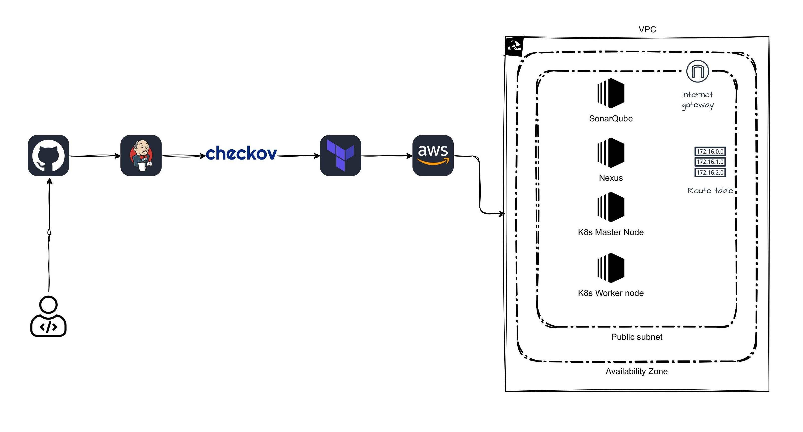

# Terraform Deployment using Jenkins with Checkov
This project focuses on building a fully automated `Infrastructure-as-Code` deployment pipeline using Terraform, integrated with `Jenkins CI/CD` and `Checkov` security scanning.

### Diagram
<p align="center">
  
</p>

## Overview

**Pipeline Stages (Jenkins)**

1️. `Git Checkout` - Clones the Terraform repository from GitHub using Jenkins credentials

2️. `Load tfvars` - Loads environment-specific Terraform variable files securely from Jenkins credentials for use in the pipeline.

3️. `Terraform Init` - Initializes Terraform modules and providers for deployment.

4️. `Checkov Security Scan`  - Runs Checkov to detect Terraform misconfigurations and publishes a report.

5️. `Terraform Plan` - Generates a Terraform execution plan to preview infrastructure changes.

6️. `Terraform Apply` - Applies the Terraform plan to provision or update cloud infrastructure.

7. `Notification` - Sends build notifications + Checkov report via email.

## Infrastructure Deployed

*Using Terraform, the pipeline creates:*

- Custom VPC with public subnets, route tables, IGW

- Security groups for SonarQube, Nexus, and Kubernetes nodes

- EC2 instances for SonarQube, Nexus Repository Manager, and Kubeadm (Master/Worker)

- User Data for automated installation and setup


## Prerequisites
Before Running This project, Make sure you have the following prerequisites ready:

### Local / Developer Requirements
-  Terraform v1.11.4 installed
-  AWS CLI configured with IAM user credentials (Access Key & Secret Key)
-  Public and Private Key

### Jenkins Requirements

-  Jenkins installed on a server (EC2, VM etc.)
-  Required Jenkins plugins: AWS Credentials
-  Jenkins credentials configured for: Github Repo., AWS Access Key & Secret Key and *.tfvars file
-  Checkov (via pip) Installed 
-  Terraform v1.11.4 installed

### Create a Jenkins Pipeline Job*

**Path:** `Jenkins > New Item`

1. Name: `Infra`
2. Type: `Pipeline`
3. Discard Old Builds → Keep for 100 days, max 2 builds
4. Add pipeline script:

```groovy
pipeline {
    agent any

    stages {
        stage('Git Checkout') {
            steps {
                git 'https://github.com/xrootms/Terraform-Nexus-SonarQube-Kubeadm-setup.git'
            }
        }
        stage('Load tfvars') {
            steps {
                withCredentials([file(credentialsId: 'tvars', variable: 'TFVARS')]) {
                  sh '''
                  ls -l
                  rm -f terraform.tfvars
                  ls -l
                  cp $TFVARS terraform.tfvars
                  ls -l
                  '''
                }
            }
        }
        stage('terraform init') {
            steps {
                withCredentials([aws(accessKeyVariable: 'AWS_ACCESS_KEY_ID', credentialsId: 'aws-creds', secretKeyVariable: 'AWS_SECRET_ACCESS_KEY')]) {
                  sh 'terraform init'
              }
            }
        }
        stage('Checkov Scan') {
            steps {
                catchError(buildResult: 'SUCCESS') {
                    // Run Checkov and save report directly
                    sh "checkov -d . -o junitxml --output-file-path checkov-report.xml"
                    
                    // Publish Checkov JUnit report in Jenkins
                    junit testResults: 'checkov-report.xml', skipPublishingChecks: true
                 }
                 // Archive the report
                 archiveArtifacts artifacts: 'checkov-report.xml', onlyIfSuccessful: false
             }
          }
       stage('terraform plan') {
            steps {
                withCredentials([aws(accessKeyVariable: 'AWS_ACCESS_KEY_ID', credentialsId: 'aws-creds', secretKeyVariable: 'AWS_SECRET_ACCESS_KEY')]) {
                  sh 'terraform plan -var-file=terraform.tfvars -out=tfplan'
              }
            }
        }
        /*stage('terraform Apply') {
            steps {
                withCredentials([aws(accessKeyVariable: 'AWS_ACCESS_KEY_ID', credentialsId: 'aws-creds', secretKeyVariable: 'AWS_SECRET_ACCESS_KEY')]) {
                  sh 'terraform apply -auto-approve -var-file=terraform.tfvars'
              }
            }
        }*/
    }
    post {
            always {
                script {
                    def job = env.JOB_NAME 
                    def build = env.BUILD_NUMBER 
                    def status = currentBuild.currentResult
                    
                    def body = """
                    <html> 
                    <body> 
                       <h2>${job} - Build #${build}</h2> 
                       <p>Status: <b>${status}</b></p> 
                       <p>Check console log: <a href="${env.BUILD_URL}">Click here</a></p> 
                     </body> 
                     </html> 
                     """
                     emailext( 
                         to: "mdsaifuddin.ek@gmail.com",
                         subject: "Build #${build} - ${status}",
                         body: body,
                         mimeType: "text/xml",
                         attachmentsPattern: "**/checkov-report.xml"
                          )
            }
        }
    }
 }


```

### clicking Build Now 


### Verify the Setup
✔ Repo cloned  
✔ tfvars loaded  
✔ Terraform init OK  
✔ Checkov scan and checkov-report.xml archived OK  
✔ Terraform plan OK  
✔ Terraform apply OK  
✔ Email notification received with Checkov report ok

#### 5. Get ssh connection for EC2:

